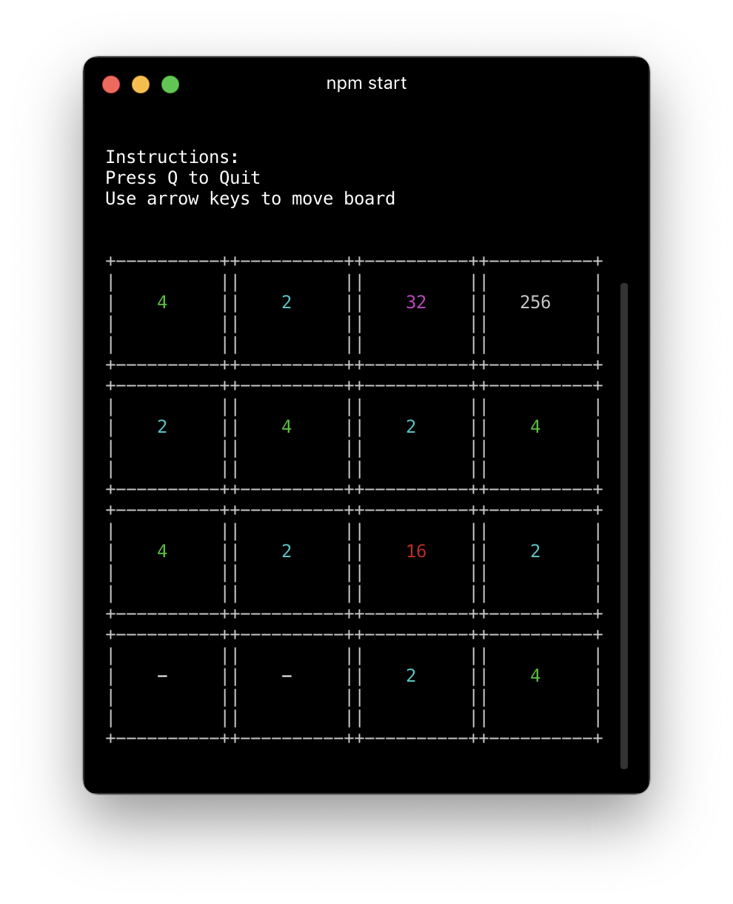

# 2048

CLI implementaiton of the game "2048".



## Playing

Quickly:

```
$ npx 2048-cli
```

From source:

```
$ git clone https://github.com/ozziexsh/2048.git
$ cd 2048
$ npm i
$ npm start
```

## Testing

Testing done via jest

```
$ npm test
```

## Contributing

PR's welcome!

Tech stack is

- Node
- TypeScript
- React
- [ink](https://github.com/vadimdemedes/ink)
- jest
- Prettier
- ESLint

The code is broken out into a few pieces:

- [board.ts](https://github.com/ozziexsh/2048/blob/master/src/board.ts) - This is the class that handles the position of numbers on the board as well as moving them around. Contains logic for combing numbers together however doesn't perform any special checks when calling the respective `moveXyz` methods.
- [game.ts](https://github.com/ozziexsh/2048/blob/master/src/game.ts) - This class contains a single board instance and performs more logic around the moves such as spawning new numbers.
